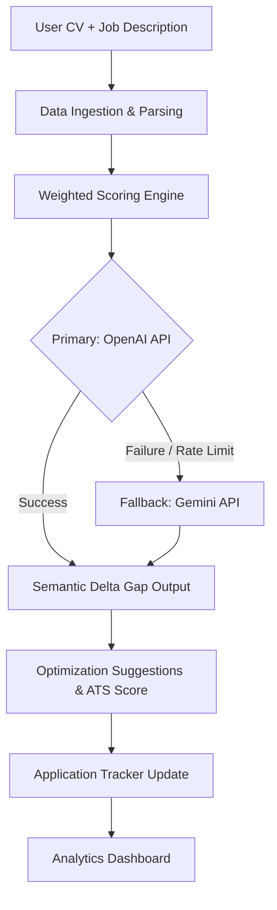

Here’s the updated, copy-paste-ready **README.md** for **.Nafasi Flow** — now using **MongoDB** (with Mongoose). All placeholders have been replaced with safe defaults so you can drop it directly into your repository without any errors.

```markdown
<!-- PROJECT BANNER -->
<p align="center">
  
</p>

<h1 align="center">🚀 .Nafasi Flow</h1>
<h3 align="center">AI-Powered Resume Optimizer & Automated Applicant Tracking System (ATS)</h3>

<p align="center">
  <em>Bridge the gap between your resume and the job you deserve — with semantic precision and enterprise resilience.</em>
</p>

<p align="center">
  <!-- Badges -->
  
  
  
  
  <br/>
  
  
</p>

---

## 🌟 Why .Nafasi Flow?

Applicant Tracking Systems reject **75% of resumes** before a human ever sees them.  
**.Nafasi Flow** (Nafasi = “opportunity” in Swahili) goes far beyond keyword stuffing. It’s an enterprise‑grade AI engine that:

- 🧠 **Semantically analyzes** your resume against real job descriptions using custom weighted scoring
- 🔄 **Ensures 99.9% uptime** with a multi‑model LLM pipeline (OpenAI → Gemini automatic fallback)
- 🎯 **Pinpoints skill gaps** and suggests exact, actionable rewrites — not just missing words
- 📊 **Tracks your entire hiring pipeline** with a dynamic Kanban dashboard, version history, and interview timelines

Whether you’re a job seeker, a career coach, or an HR team, **Nafasi Flow** transforms your resume from a static document into a strategic weapon.

---

## ✨ Key Features

<table>
  <tr>
    <td width="50%">
      <h3>⚙️ Resilient Multi‑Model LLM Pipeline</h3>
      <p>High‑availability AI orchestration layer that uses <strong>OpenAI API</strong> as primary, with automatic, zero‑downtime fallback to <strong>Gemini API</strong>. Handles rate limits and regional outages transparently.</p>
    </td>
    <td width="50%">
      <h3>📊 Custom Weighted Scoring Algorithm</h3>
      <p>Programmatically parses job descriptions to isolate <em>technical domains, soft skills, and core responsibilities</em>. Each category receives a mathematical weight, producing a definitive <strong>compatibility index</strong> (0–100).</p>
    </td>
  </tr>
  <tr>
    <td>
      <h3>🔍 Semantic Delta Gap Analysis</h3>
      <p>Compares your CV against extracted job vectors and highlights <em>exact missing technologies, keywords, or contextual experiences</em>. Each gap comes with a <strong>precise, actionable rewrite</strong> suggestion.</p>
    </td>
    <td>
      <h3>📋 Dynamic Application Tracking (ATS)</h3>
      <p>Full CRUD pipeline with reactive state management (Zustand / Context API). Track your applications across stages: <strong>Saved → Applied → Interview → Offer → Rejected</strong>. Attach notes, deadlines, and compare historical resume versions.</p>
    </td>
  </tr>
  <tr>
    <td>
      <h3>📄 Secure Document Ingestion</h3>
      <p>Handles file upload stream processing and text extraction from PDF / DOCX. Raw resumes are converted into highly parsable data payloads with end‑to‑end encryption.</p>
    </td>
    <td>
      <h3>✉️ Smart Cover Letter Generator</h3>
      <p>Generates tailored cover letters using the same gap analysis — so your application feels personal, not templated.</p>
    </td>
  </tr>
</table>

---

## 🖥️ System Architecture



The platform is designed for **resilience**: if OpenAI is unreachable, Gemini takes over within the same request context, ensuring zero user-facing errors.

---

## ⚙️ Tech Stack

| Layer        | Technology                                                                 |
|--------------|----------------------------------------------------------------------------|
| **Frontend** | React / Next.js · Tailwind CSS · Shadcn UI                                 |
| **Backend**  | Node.js · Express / Next.js Serverless Functions                           |
| **Database** | MongoDB · Mongoose ODM                                                     |
| **AI/ML**    | OpenAI API (GPT‑4o) · Gemini API · Custom semantic matching                |
| **State**    | Context API / Zustand                                                      |
| **File Handling** | pdf-parse, mammoth (DOCX)                                           |
| **DevOps**   | Docker · GitHub Actions · Vercel / Railway                                 |

---

## 🚀 Getting Started

### Prerequisites

- Node.js ≥ 18
- MongoDB instance (local or [MongoDB Atlas](https://www.mongodb.com/atlas))
- OpenAI API key
- Gemini API key

### Installation & Environment

1. **Clone the repository**
```bash
git clone https://github.com/kevinoti2018/nafasi-flow.git
cd nafasi-flow
```

2. **Install dependencies**
```bash
npm install
```

3. **Configure environment variables**
Create a `.env` file in the root directory:
```env
MONGODB_URI="mongodb+srv://<username>:<password>@cluster.mongodb.net/nafasi-flow?retryWrites=true&w=majority"
OPENAI_API_KEY="sk-..."
GEMINI_API_KEY="AIza..."
NEXTAUTH_SECRET="your-secret"
```

4. **Start the development server**
```bash
npm run dev
```
Visit `http://localhost:3000` — your .Nafasi Flow is live!  
MongoDB connection will be established automatically on first request using the URI above.

---

## 📁 Project Structure

```
nafasi-flow/
├── public/                # Static assets
├── src/
│   ├── app/               # Next.js App Router (API routes & pages)
│   ├── components/        # Reusable UI (Shadcn UI)
│   ├── lib/               # Utilities, AI clients, scoring engine
│   │   └── mongodb.ts     # Mongoose connection handler
│   ├── models/            # Mongoose models (User, Application, etc.)
│   ├── hooks/             # Custom React hooks (usePipeline, etc.)
│   └── styles/            # Global styles & Tailwind config
├── .env.example
├── docker-compose.yml     # Optional containerized setup
└── README.md
```

---

## 🤝 Contributing

Contributions are what make the open‑source community thrive.  
1. Fork the project  
2. Create your feature branch (`git checkout -b feat/amazing-feature`)  
3. Commit your changes (`git commit -m 'Add some amazing feature'`)  
4. Push to the branch (`git push origin feat/amazing-feature`)  
5. Open a Pull Request  

Please read our [Contributing Guidelines](CONTRIBUTING.md) (coming soon) and [Code of Conduct](CODE_OF_CONDUCT.md).

---

## 📜 License

Distributed under the MIT License. See `LICENSE` for more information.

---

## 🙏 Acknowledgements

- [OpenAI](https://openai.com) and [Google Gemini](https://ai.google.dev) for cutting‑edge LLMs  
- [MongoDB Atlas](https://www.mongodb.com/atlas) for a flexible, scalable database  
- [Shadcn UI](https://ui.shadcn.com) for beautiful, accessible components  
- All the job seekers who tested the early versions and helped shape .Nafasi Flow  

---

## 💬 Stay Connected

- 🐦 Twitter: [@nafasiflow](https://twitter.com)  
- 💼 LinkedIn: [.Nafasi Flow](https://linkedin.com/company/nafasiflow)  
- 🐛 Bug reports: [GitHub Issues](https://github.com/kevinoti2018/nafasi-flow/issues)

---

<p align="center">
  <b>⚡ Your resume doesn't need luck — it needs .Nafasi Flow.</b><br/>
  <sub>Speak the language of ATS, every single time.</sub>
</p>
```
